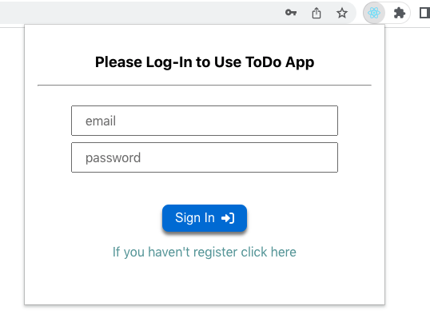
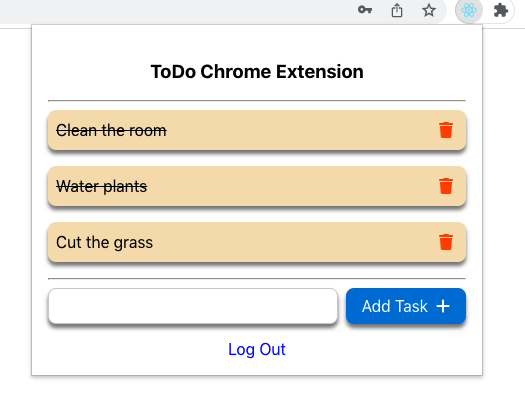

# ToDos Chrome Extension

A todos app chrome extension.

To install the app follow the next steps:

1. Go to chrome://extension
2. Activate developer mode
3. Press "Load Unpacked"
4. Select build folder from this repo
5. Done!

## App Preview:

 

 